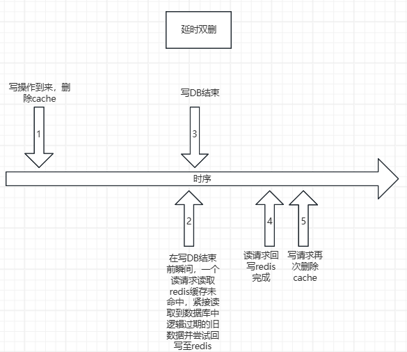
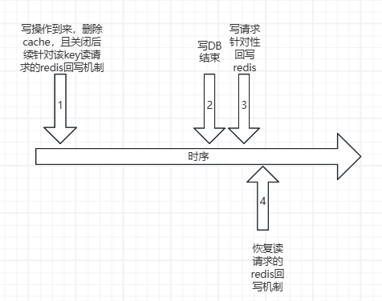

# redis_cache_coherency
基于Go语言的侧重保障较强数据一致性的Redis缓存双写一致性解决方案
（代码层面目前仅做思路的粗略演示）

### 1、基于更新cache的方案

1、先更新数据库后更新缓存；

2、先更新缓存后更新数据库

以上2种方案都存在可能因为并发执行的不确定性，导致后者更新结果错误的情况。
例如，先更新数据库，后更新缓存场景：更新数据库A->1000，B->800，但在继续更新缓存时，有可能出现B先写入800，而A后写入1000的情况，导致数据不一致；
同理，先更新缓存，后更新数据库场景：更新缓存A->1000，B->800，但在继续更新数据库时，有可能出现B先写入800，而A后写入1000的情况，导致数据不一致；

### 2、基于删除cache的方案（利用读请求下的redis回写机制）

1、先删除缓存，后更新数据库
主要利用读请求场景下的redis回写机制，将缓存重新加载进redis。存在的问题：在删除缓存和完成写DB操作之间的窗口期到来的读请求，会读到在业务逻辑上过期的旧数据，并且在回写机制下又将这些旧数据重新加载进redis，由此问题引出了“延时双删”策略，即在写操作完成之后延迟一段时间，再次删除redis中的缓存，由后续的读请求重新触发回写，加载最新的数据进入缓存。

2、先更新数据库，后删除缓存
一般业务上以数据库作为底单数据。
建议先更新数据库，再删除缓存（利用redis回写机制更新；删除操作失败时结合消息队列保证最终成功；容忍短暂时间的数据弱一致）。

### 3、考虑方案（侧重保证热点key数据较强一致性）

（1）删除cache并临时禁用读请求的回写cache机制，期间的读请求全部由数据库承接（实质上可认为是一次主动触发的缓存击穿问题，结合singleflight进行读请求优化。从写db开始到写结束的窗口期，由于MVCC机制，可能读到业务逻辑上即将过期的旧数据，此时不能保证数据一致性。）；

（2）写操作结束后（若是热点的业务key（自行根据业务情况判断），针对性地附加一次主动回写redis的动作。从写db结束到主动回写redis成功的窗口期，读请求仍然由singleflight+数据库承接，但这个窗口期已经能够保证数据一致性，因为读到的是数据库中最新的数据）；

（3）恢复读操作回写redis的机制（后续数据自然过期时继续由读请求进行缓存回写）；

（4）个人理解：以写事务提交为分界线，结合事务的原子性和一致性概念，以及考虑MVCC只能读到已提交事务的数据这一机制，在写事务提交之前的读请求所查询到的数据，在业务逻辑上也应该是合法的（例如非秒杀场景下的库存扣减，读请求查询到仍有库存，紧接着尝试获取分布式锁进行库存扣减，但在真正执行扣减的时候，库存已被前面的写操作更新为0，扣减业务正常失败；又如商品的活动价，读请求查询到的是仍在活动中的价格，在点击下单支付的时候，价格已经被前面的写操作更新为正常价格，支付业务正常失败。也即依靠后续业务的正常失败作为兜底，保证始终以数据库作为底单数据。），将问题更加侧重在保证写DB操作结束之后到来的读请求所查询到的数据的强一致性（例如写事务提交完成瞬间，无论如何处理，即使在写事务提交完成同时立即发起redis回写动作，由于存在跨组件更新的窗口期，cache中的数据也一定是业务逻辑过期的，所以考虑以写请求到达为起点，到写请求主动回写cache成功（若回写失败则结合消息队列保证回写的最终成功）为终点，这段窗口期都不使用该key的redis缓存，期间所有的读请求压力视为是对缓存击穿问题的处理，结合singleflight进行优化。）
